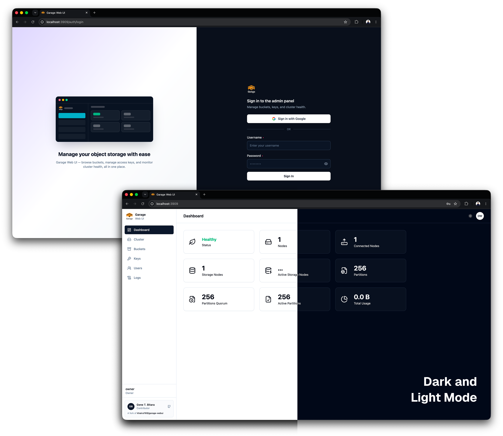
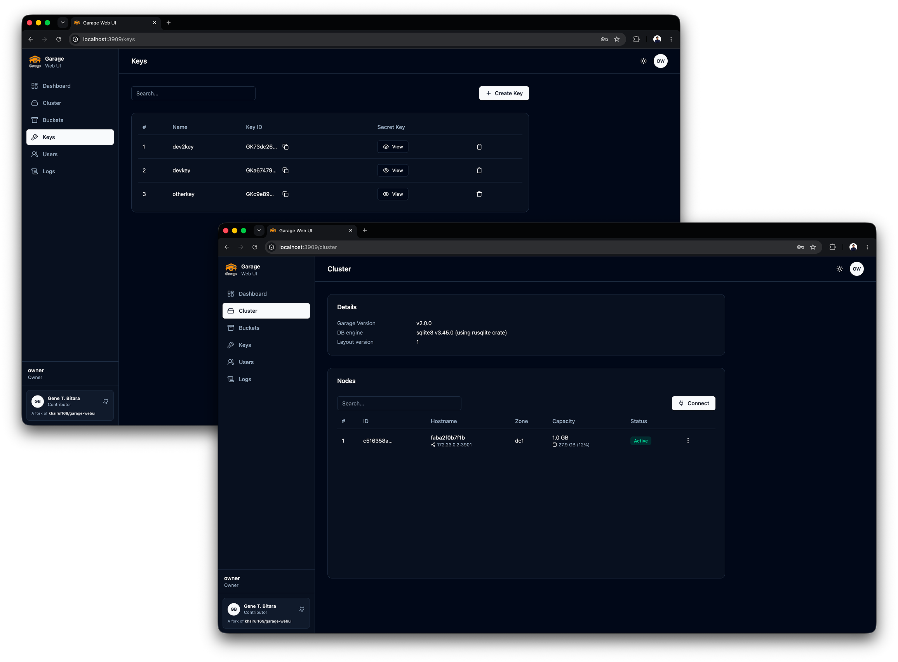
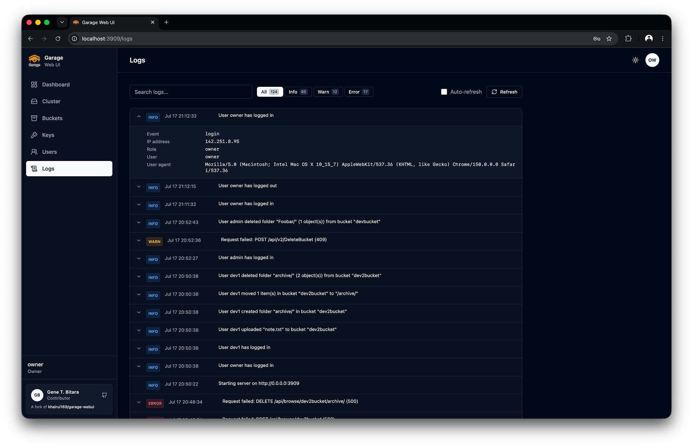

# Garage Web Console

[](misc/img/login-dashboard.png)

A simple admin web UI for [Garage](https://garagehq.deuxfleurs.fr/), a self-hosted, S3-compatible, distributed object storage service.

[ [Screenshots](misc/SCREENSHOTS.md) | [Install Garage](https://garagehq.deuxfleurs.fr/documentation/quick-start/) | [Garage Git](https://git.deuxfleurs.fr/Deuxfleurs/garage) ]

> Copied, then heavily retrofitted from:
> [khairul169/garage-webui](https://github.com/khairul169/garage-webui)
> [genebit/s3-garagehq-webui](https://github.com/genebit/s3-garagehq-webui)

## Features

**Core** (from upstream)

- Garage health status dashboard
- Cluster & layout management
- Create, update, or view bucket information
- Integrated objects/bucket browser
- Create & assign access keys

**Access control & security** _(added in this fork)_

- Multi-user accounts with **owner / admin / developer** roles, replacing the single shared login
- One-time **owner registration** screen on first launch (no users yet)
- **Developers** are scoped to only the buckets explicitly assigned to them (browse, upload,
  download, delete objects, view their own keys) — no cluster, key, or user management
- Optional **OIDC sign-in**, deny-by-default: a provider account can only sign in
  if an admin has already created a matching user, with a configurable hosted-domain allowlist
- Self-service **change password** for any signed-in user
- **Audit log viewer** (owner/admin only) recording human-readable footprint events — logins,
  failed logins, user management, object uploads/deletes/moves — each with IP, user agent, and actor

**Object management** _(added in this fork)_

- **Multi-select** files and folders in the object browser
- Bulk **delete**, **share**, and **move** — moving supports nested destination folders, created via
  a breadcrumb folder picker
- **Drag-and-drop upload**, including whole folders and nested folder trees (recreated in the bucket
  exactly as dropped), plus a folder picker button
- Background **upload queue** with a progress panel (per-file and overall progress, cancel, retry
  visibility) so large uploads don't block the UI

**UI** _(redesigned in this fork)_

- Svelte 5 components retaining the original [shadcn](https://www.shadcn-svelte.com/) design,
  with [Bits UI](https://bits-ui.com/) accessible dialog primitives and the existing Tailwind theme tokens
- Simplified to **light/dark mode** only (previously a multi-theme picker)

## Screenshots

More in [misc/SCREENSHOTS.md](misc/SCREENSHOTS.md).

|                                                                                                                                                                                    |                                                                                                                                          |
| ---------------------------------------------------------------------------------------------------------------------------------------------------------------------------------- | ---------------------------------------------------------------------------------------------------------------------------------------- |
| [](misc/img/login-dashboard.png) <br> Login (password + OIDC sign-in) and the cluster health dashboard, in light and dark mode | [](misc/img/clusters-keys.png) <br> Cluster node details and access key management |
| [](misc/img/object-mgt.png) <br> Buckets, multi-select bulk actions, and the background upload progress panel              | [](misc/img/user-mgt.png) <br> Managing users, roles, and OIDC-linked accounts                  |
| [](misc/img/logs.png) <br> Searchable, filterable audit log with expandable request details                                                        |                                                                                                                                          |

## Installation

The Garage Web UI is available as a single executable binary and docker image. You can install it using the command line or with Docker Compose.

> **Note on this fork:** this section references `genebit/garage-webui`, the image published from
> this fork. The upstream `khairul169/garage-webui` image does not include this fork's features
> (access control, OIDC sign-in, audit logs, bulk object management, drag-and-drop uploads, or
> the redesigned UI). You can also build the image yourself from source — see
> [Development](#development) → [Running the fork locally with Docker](#running-the-fork-locally-with-docker).

### Docker CLI

```sh
$ docker run -p 3909:3909 -v ./garage.toml:/etc/garage.toml:ro --restart unless-stopped --name garage-webui genebit/garage-webui:latest
```

### Docker Compose

If you install Garage using Docker, you can install this web UI alongside Garage as follows:

```yml
services:
  garage:
    image: dxflrs/garage:v2.0.0
    container_name: garage
    volumes:
      - ./garage.toml:/etc/garage.toml
      - ./meta:/var/lib/garage/meta
      - ./data:/var/lib/garage/data
    restart: unless-stopped
    ports:
      - 3900:3900
      - 3901:3901
      - 3902:3902
      - 3903:3903

  webui:
    image: genebit/garage-webui:latest # or build from source, see Development
    container_name: garage-webui
    restart: unless-stopped
    volumes:
      - ./garage.toml:/etc/garage.toml:ro
      - webui-data:/data # required: user accounts, audit logs, upload temp files
    ports:
      - 3909:3909
    environment:
      API_BASE_URL: 'http://garage:3903'
      S3_ENDPOINT_URL: 'http://garage:3900'

volumes:
  webui-data:
```

The `webui-data` volume is required by this fork — it persists the user accounts store, audit
logs, and temporary files used while streaming large uploads. See
[Environment Variables](#environment-variables) to customize its layout.

### Without Docker

Get the latest upstream binary from the [release page](https://github.com/khairul169/garage-webui/releases/latest), or build this fork's binary yourself (see [Development](#development)):

```sh
$ wget -O garage-webui https://github.com/khairul169/garage-webui/releases/download/1.1.0/garage-webui-v1.1.0-linux-amd64
$ chmod +x garage-webui
$ sudo cp garage-webui /usr/local/bin
```

Run the program with specified `garage.toml` config path.

```sh
$ CONFIG_PATH=./garage.toml garage-webui
```

If you want to run the program at startup, you may want to create a systemd service.

```sh
$ sudo nano /etc/systemd/system/garage-webui.service
```

```
[Unit]
Description=Garage Web UI
After=network.target

[Service]
Environment="PORT=3919"
Environment="CONFIG_PATH=/etc/garage.toml"
ExecStart=/usr/local/bin/garage-webui
Restart=always

[Install]
WantedBy=default.target
```

Then reload and start the garage-webui service.

```sh
$ sudo systemctl daemon-reload
$ sudo systemctl enable --now garage-webui
```

### Configuration

To simplify installation, the Garage Web UI uses values from the Garage configuration, such as `rpc_public_addr`, `admin.admin_token`, `s3_web.root_domain`, etc.

Example content of `garage.toml`:

```toml
metadata_dir = "/var/lib/garage/meta"
data_dir = "/var/lib/garage/data"
db_engine = "sqlite"
metadata_auto_snapshot_interval = "6h"

replication_factor = 3
compression_level = 2

rpc_bind_addr = "[::]:3901"
rpc_public_addr = "localhost:3901" # Required
rpc_secret = "YOUR_RPC_SECRET_HERE"

[s3_api]
s3_region = "garage"
api_bind_addr = "[::]:3900"
root_domain = ".s3.domain.com"

[s3_web] # Optional, if you want to expose bucket as web
bind_addr = "[::]:3902"
root_domain = ".web.domain.com"
index = "index.html"

[admin] # Required
api_bind_addr = "[::]:3903"
admin_token = "YOUR_ADMIN_TOKEN_HERE"
metrics_token = "YOUR_METRICS_TOKEN_HERE"
```

However, if it fails to load, you can set `API_BASE_URL` & `API_ADMIN_KEY` environment variables instead.

### Environment Variables

Configurable envs:

| Variable                                | Default                        | Description                                                                                                                                     |
| --------------------------------------- | ------------------------------ | ----------------------------------------------------------------------------------------------------------------------------------------------- |
| `CONFIG_PATH`                           | `/etc/garage.toml`             | Path to the Garage `config.toml` file.                                                                                                          |
| `BASE_PATH`                             | _(none)_                       | Base path or prefix for the Web UI.                                                                                                             |
| `API_BASE_URL`                          | _(from config)_                | Garage admin API endpoint URL.                                                                                                                  |
| `API_ADMIN_KEY`                         | _(from config)_                | Garage admin API key.                                                                                                                           |
| `S3_REGION`                             | `garage`                       | S3 region.                                                                                                                                      |
| `S3_ENDPOINT_URL`                       | _(from config)_                | S3 endpoint URL.                                                                                                                                |
| `HOST`                                  | `0.0.0.0`                      | Address the server listens on.                                                                                                                  |
| `PORT`                                  | `3909`                         | Port the server listens on.                                                                                                                     |
| `AUTH_USER_PASS`                        | _(none)_                       | Legacy single-user login, `username:bcrypt_hash`. Only used while no users are registered — see [Access Control](#access-control-users--roles). |
| `USERS_PATH`                            | `/data/users.json`             | Where the multi-user account store is persisted.                                                                                                |
| `LOGS_PATH`                             | `/data/logs/app.log`           | Where the audit log file is persisted.                                                                                                          |
| `TMPDIR`                                | `/data/tmp`                    | Temp directory used while streaming large object uploads to disk.                                                                               |
| `OIDC_ISSUER`                           | _(none)_                       | Provider's exact issuer URL; enables OIDC together with client ID and redirect URL.                                                             |
| `OIDC_CLIENT_ID` / `OIDC_CLIENT_SECRET` | _(none)_                       | Registered client credentials; omit the secret only for a public client.                                                                        |
| `OIDC_REDIRECT_URL`                     | _(none)_                       | Exact public callback URL, including any `BASE_PATH`.                                                                                           |
| `OIDC_SCOPES`                           | `email profile`                | Space- or comma-separated scopes; `openid` is always included.                                                                                  |
| `OIDC_ALLOWED_DOMAINS`                  | _(unrestricted)_               | Optional comma-separated email-domain allowlist; existing local account still required.                                                         |
| `OIDC_REQUIRE_VERIFIED_EMAIL`           | `true`                         | Require a verified email claim. See the provider trust requirements below before disabling.                                                     |
| `OIDC_BUTTON_TEXT`                      | `Continue with OpenID Connect` | Login button label, rendered as plain text.                                                                                                     |
| `OIDC_BUTTON_ICON_URL`                  | _(built-in key icon)_          | HTTPS image URL or root-relative image path, including `BASE_PATH` where applicable.                                                            |

`USERS_PATH`, `LOGS_PATH`, and `TMPDIR` all default under `/data`, so make sure that directory is a
writable, persistent volume (see the `webui-data` volume in the Docker Compose example above).

### Authentication

Enable authentication by setting the `AUTH_USER_PASS` environment variable in the format `username:password_hash`, where `password_hash` is a bcrypt hash of the password.

Generate the username and password hash using the following command:

```bash
htpasswd -nbBC 10 "YOUR_USERNAME" "YOUR_PASSWORD"
```

> If command 'htpasswd' is not found, install `apache2-utils` using your package manager.

Then update your `docker-compose.yml`:

```yml
webui:
  ....
  environment:
    AUTH_USER_PASS: "username:$2y$10$DSTi9o..."
```

> This is a legacy, single-account fallback kept for compatibility with upstream deployments. It
> only takes effect while no users exist in the account store — see the next section for the
> recommended multi-user setup.

### Access Control (users & roles)

The Web UI supports multiple users with role-based access instead of a single
shared login. Users are stored in a JSON file on a mounted volume (default
`/data/users.json`, configurable via the `USERS_PATH` environment variable), so
make sure the `webui` service has a writable `/data` volume as shown above.

On first launch, when no users exist, the UI shows a one-time registration
screen to create the initial **owner** account. Afterwards, registration is
closed and users sign in normally.

Roles:

- **owner** — full access, including managing all users (owners included).
- **admin** — manage buckets, keys, cluster, and users (but cannot modify owner
  accounts).
- **developer** — can only browse, upload, download, delete, and move objects, and view
  info and their own keys for the buckets explicitly assigned to them. No cluster, bucket
  creation, key management, or user management.

Every signed-in user can change their own password from the sidebar (**Change password**),
except accounts authenticated via the legacy `AUTH_USER_PASS` fallback.

The legacy `AUTH_USER_PASS` variable still works as a single-owner fallback, but
only while the user store is empty. Once any user is registered, the user store
takes over.

#### OIDC sign-in (optional)

Configure one OpenID Connect provider using discovery. The Go backend handles the
Authorization Code flow with PKCE (S256); tokens and client secrets stay out of
the SPA. Password sign-in remains available. Discovery failures can be retried
without restarting the application.

Sign-in requires an existing local user with a matching email address. Create the
owner account first, then use **Users** to set its email or add more users. Passwords
can be left blank when creating OIDC-only users. Local roles and bucket assignments
remain authoritative; provider groups do not automatically grant access or create users.
Email matching is case-insensitive and requires `email_verified: true` by default.
The backend checks signed ID tokens and falls back to UserInfo when email or its
verification claim is missing, requiring the UserInfo subject to match the ID token.

For Pocket ID, create an OIDC client, enable PKCE, and register this callback:
`https://console.example.com/api/v1/auth/oidc/callback`. Then configure the backend:

```dotenv
OIDC_ISSUER=https://id.example.com
OIDC_CLIENT_ID=your-client-id
OIDC_CLIENT_SECRET=your-client-secret
OIDC_REDIRECT_URL=https://console.example.com/api/v1/auth/oidc/callback
OIDC_BUTTON_TEXT=Sign in with Pocket ID
# Optional: use an image you host, or omit for the built-in key icon.
OIDC_BUTTON_ICON_URL=https://id.example.com/your-logo.png
# Optional extra restriction:
# OIDC_ALLOWED_DOMAINS=example.com
```

Use the exact issuer reported by the provider's discovery document, including a
trailing slash when present. HTTPS is required except for loopback development.
For `BASE_PATH=/console`, register and configure
`https://example.com/console/api/v1/auth/oidc/callback`. The configured URL is used
verbatim; request Host and forwarding headers cannot change it. Restart after
changing environment variables. Missing or invalid required configuration hides
the OIDC button.

Pocket ID must mark the user's email as verified. Its [email verification setup
example](https://pocket-id.org/docs/client-examples/yuvomi) describes enabling
**Emails Verified** and verifying individual users. Keep verification enabled here.

These provider configurations use the same generic flow (live deployments of each
provider are not part of the automated test suite):

| Provider                                                                                           | Issuer / setup notes                                                                                                                                                                |
| -------------------------------------------------------------------------------------------------- | ----------------------------------------------------------------------------------------------------------------------------------------------------------------------------------- |
| Pocket ID                                                                                          | Instance URL, e.g. `https://id.example.com`; enable PKCE and verified emails.                                                                                                       |
| [Keycloak](https://www.keycloak.org/securing-apps/oidc-layers)                                     | `https://id.example.com/realms/<realm>`; enable Standard Flow and email verification.                                                                                               |
| [Authentik](https://docs.goauthentik.io/add-secure-apps/providers/oauth2)                          | `https://id.example.com/application/o/<slug>/`; use per-provider issuer mode and email/profile scope mappings. Global issuer mode is not supported by this discovery configuration. |
| [Auth0](https://auth0.com/docs/authenticate/identity-providers/enterprise-identity-providers/oidc) | Exact tenant/custom-domain issuer, commonly `https://<tenant>.us.auth0.com/`; register a Regular Web Application.                                                                   |
| [Okta](https://developer.okta.com/docs/concepts/auth-servers/)                                     | Org issuer or configured authorization-server issuer, e.g. `https://<org>.okta.com/oauth2/default`; register an OIDC web client.                                                    |
| [Google](https://developers.google.com/identity/openid-connect/reference)                          | `https://accounts.google.com`; register an OAuth web client.                                                                                                                        |
| [Microsoft Entra ID](https://learn.microsoft.com/en-us/entra/identity-platform/v2-protocols-oidc)  | `https://login.microsoftonline.com/<tenant-GUID>/v2.0`; use a specific tenant, not `common` or `organizations`, and configure an email claim. See below.                            |

Use a confidential web client with a secret when supported. Public clients with
PKCE are also supported. Client-secret basic/post authentication is handled by
`golang.org/x/oauth2`; private-key JWT and mutual-TLS client authentication are not
implemented. Providers must support discovery and authorization-code callbacks
using query parameters.

Some enterprise providers do not emit `email_verified`. Prefer configuring that
claim correctly. `OIDC_REQUIRE_VERIFIED_EMAIL=false` explicitly trusts the configured
provider's email claims, including unverified addresses. Only use this with a tightly
controlled provider where users cannot choose another person's email; otherwise they
could access that person's existing local account. An email-domain allowlist does not
prove tenant membership or email ownership. Entra deployments need particular care
because [email is not a stable identity identifier](https://learn.microsoft.com/en-us/entra/identity-platform/id-token-claims-reference).

This preserves the existing email-based account matching model; it does not bind
accounts permanently to an issuer/subject pair. Logout ends the local console
session, not the provider session. The authorization transaction expires after ten
minutes and its state/nonce/PKCE verifier are consumed on callback.

Button icons are loaded as images (PNG, SVG, etc.), never injected as HTML. Use an
HTTPS URL or a root-relative path served by your deployment. Relative paths must
include any deployment prefix, for example `/console/favicon-32x32.png`. Unset or
invalid icon URLs use the built-in key icon; the label has a default too. These
settings are delivered by the backend and require no frontend rebuild.

**Migrating from Google-specific configuration:** replace `GOOGLE_CLIENT_ID` and
`GOOGLE_CLIENT_SECRET` with their `OIDC_` counterparts, set
`OIDC_ISSUER=https://accounts.google.com`, and configure `OIDC_REDIRECT_URL` with the
new `/api/v1/auth/oidc/callback` route. Update the registered redirect URI at Google.
To retain email-domain restrictions, explicitly set `OIDC_ALLOWED_DOMAINS`; the old
institution-specific defaults and Google `hd` fallback are removed. Old `GOOGLE_*`
variables and `/auth/google/*` routes are no longer used. Existing users need no
migration. Set `OIDC_BUTTON_TEXT=Continue with Google` to keep the familiar label.

### Object management

The bucket **Browse** tab supports selecting multiple files and folders (checkbox per row, or
select-all) to:

- **Delete** — files and folders (recursively) in one action
- **Share** — generate shareable URLs for every selected file at once
- **Move** — relocate the selection into another folder, including nested folders, via a
  breadcrumb-style folder picker; you can create new destination folders on the fly

Files and folders can also be **dragged and dropped** directly onto the Browse tab — dropping a
folder recreates its structure (including nested subfolders) in the bucket. A folder-picker button
is available as an alternative to dragging. Uploads run through a background queue shown in a
progress panel at the bottom-right of the screen, with per-file and overall progress, so you can
keep navigating the app while an upload is in flight.

### Logs (audit trail)

Owners and admins have access to a **Logs** page in the sidebar, showing a searchable,
filterable, paginated view of application audit events — logins and failed login attempts,
registrations, password changes, OIDC sign-in denials, user account changes, and object
uploads/deletes/moves. Each entry is collapsible to reveal footprint details (IP address, user
agent, acting user/role, and action-specific fields like the bucket/key involved).

Logs are persisted to `LOGS_PATH` (default `/data/logs/app.log`) on the `webui-data` volume, so
history survives restarts.

### Running

Once your instance of Garage Web UI is started, you can open the web UI at http://your-ip:3909. You can place it behind a reverse proxy to secure it with SSL.

## Development

The frontend is a client-rendered **SvelteKit 3 SPA** using Svelte 5 and TypeScript.
SvelteKit is pinned to `3.0.0-next.27` (the latest `next` prerelease verified on
September 16, 2026), with `@sveltejs/adapter-static` `4.0.0-next.4`.
The Go backend owns all API endpoints, authentication, authorization, and storage access.

SSR and prerendering are disabled in `src/routes/+layout.ts`. The static adapter
outputs `dist/index.html` and browser assets; production requires **no Node server**.
The existing Docker build embeds this directory in the Go binary. SvelteKit 3
configuration lives in `vite.config.ts`, with `#lib/*` and `#src/*` package imports.

`BASE_PATH` remains a runtime setting: Go substitutes the build marker
`/__garage_base__` in HTML, JavaScript, and CSS. This allows the same binary to
serve `/`, `/console`, or another path without rebuilding. Go's `all:dist` embed
pattern includes SvelteKit's `_app` assets. For a standalone static host, replace
the marker with the deployment prefix and route unknown client paths to `index.html`.

### Prerequisites

- [Node.js](https://nodejs.org/) 22.12+ and [pnpm](https://pnpm.io/) 11.19.0 (pinned automatically via
  corepack from the `packageManager` field in `package.json`)
- [Go](https://go.dev/) 1.27.1+
- [air](https://github.com/air-verse/air) for backend hot-reload during local (non-Docker) dev:
  `go install github.com/air-verse/air@latest`

### Setup

```sh
$ git clone https://github.com/genebit/s3-garagehq-webui.git
$ cd s3-garagehq-webui
$ pnpm install
```

The backend has no separate install step — its Go module dependencies resolve automatically when
you build or run it (`go build` / `air`).

### Running

Start both the client and server concurrently:

```sh
$ pnpm run dev # or npm run dev
```

Or start each instance separately:

```sh
$ pnpm run dev:client   # Vite dev server
$ cd backend && air     # Go backend with hot reload
```

The Vite dev server proxies `/api` requests to the Go backend — set `VITE_API_URL` in a `.env`
file if the backend isn't on the default `http://localhost:3909`.

### Frontend validation

```sh
pnpm check       # Svelte and TypeScript diagnostics
pnpm lint
pnpm test        # Object paths, directory drops, and upload queue tests
pnpm build      # Static SPA in dist/
pnpm exec playwright install chromium
pnpm test:e2e   # Builds the SPA, then tests it through the production Go UI handler
```

Browser tests require Go. They use isolated mock API responses and exercise the
real compiled frontend and Go asset handler at `/`, `/console`, and `/tools/garage`.
They cover setup/login, role restrictions, users, keys, cluster layout, bucket
settings, object operations, uploads, logs, themes, and mobile navigation. They do
not require or mutate a live Garage instance. To use an installed Chrome instead
of downloading Chromium, set `PLAYWRIGHT_CHANNEL=chrome`.

The browser-test host copies `dist/` to the ignored `backend/ui/dist/` directory.
After that, run `go test -tags=prod ./ui` from `backend/` to check embedded assets
and runtime base-path rewriting separately. `go test ./...` checks the regular
backend packages.

### Backend toolchain and dependencies

The Go module and Docker builder target **Go 1.27.1**. Direct dependencies and
transitive dependencies used by the application were updated to their latest
stable releases on September 17, 2026. `godotenv` and `nfnt/resize` retain their
existing versions because those are still their latest published releases.

The S3 client uses the AWS SDK's `BaseEndpoint` API with path-style bucket URLs.
Optional AWS checksum calculation and validation are set to `WhenRequired` to
preserve Garage compatibility; required operation checksums remain enabled.
HTTP/HTTPS integration tests cover signing, reserved object-key characters,
uploads, empty folder markers, downloads, and bulk deletes. Authentication tests
exercise bcrypt, persistent password changes, and SCS session cookies through
the real API handlers.

From `backend/`:

```sh
go test ./...
go vet ./...
go mod verify
go mod tidy -diff
go run golang.org/x/vuln/cmd/govulncheck@latest ./...
# After the frontend assets have been copied into ui/dist:
go test -tags=prod ./...
go vet -tags=prod ./...
```

`go list -m -u all` also lists optional modules declared by upstream dependencies
that are not imported into this application. Go's module pruning leaves those
at the upstream-declared versions; `go mod why -m <module>` distinguishes these
from dependencies used by the backend.

### Running the fork locally with Docker

If you'd rather not install Go/Node locally, you can build and run this fork entirely through
Docker Compose, without touching the tracked `docker-compose.yml` (which points at the upstream
image):

1. Create a `garage.toml` at the repo root (gitignored) with a minimal single-node config — see
   [Configuration](#configuration). For local dev, `replication_factor = 1` is sufficient.
2. Create a `docker-compose.override.yml` (gitignored, automatically merged by `docker compose`)
   that builds the `webui` service from source instead of pulling the published image:

   ```yml
   services:
     webui:
       image: garage-webui:local
       build:
         context: .
         dockerfile: Dockerfile
   ```

3. Build and start the stack:

   ```sh
   $ docker compose build webui
   $ docker compose up -d
   ```

4. Open http://localhost:3909 — on first launch you'll see the owner registration screen. A fresh
   Garage cluster also needs a one-time layout assignment from the **Cluster** page before buckets
   work.

After changing source code, rebuild and restart just the `webui` service:

```sh
$ docker compose up -d --build webui
```

## Troubleshooting

Make sure you are using the latest version of Garage. If the data cannot be loaded, please check whether your instance of Garage has the admin API enabled and the ports are accessible.

Large uploads are buffered to disk (`TMPDIR`, default `/data/tmp`) while streaming to Garage, so
ensure the `webui-data` volume has enough free space for the largest file you expect to upload.
Objects near or above 5 GiB may fail — that's the S3 protocol's limit for a single-request upload;
true multi-gigabyte objects need multipart upload, which isn't implemented in this fork yet.

If you encounter any problems, please do not hesitate to submit an issue [here](https://github.com/genebit/s3-garagehq-webui/issues). You can describe the problem and attach the error logs (the in-app **Logs** page, or `LOGS_PATH` on disk, may also help).

## Contributors

- [khairul169](https://github.com/khairul169) — original author of [garage-webui](https://github.com/khairul169/garage-webui)
- **Gene T. Bitara** — access control & RBAC, Google sign-in, audit log viewer, bulk object
  management (multi-select, move, share), drag-and-drop uploads with background progress, and the
  shadcn/ui redesign, in this fork ([genebit/s3-garagehq-webui](https://github.com/genebit/s3-garagehq-webui))

## Brand assets

The Garage mark is sourced from [selfh.st/icons](https://cdn.jsdelivr.net/gh/selfhst/icons@main/svg/garage.svg).
`src/assets/garage-logo.svg` is the canonical source. A warm ivory tile preserves its
original gray and orange colors in both themes. The centered login layout follows
[shadcn login-05](https://www.shadcn-svelte.com/blocks/login), with the application's
username/password, first-run setup, and configurable OIDC flow retained.

To regenerate the SVG, PNG, Apple touch, and ICO browser icons after changing the source:

```sh
PLAYWRIGHT_CHANNEL=chrome node scripts/generate-icons.mjs
```

Omit `PLAYWRIGHT_CHANNEL` to use Playwright's installed Chromium. The app uses warm
neutral theme tokens with orange accents; the login theme toggle shares the saved
preference with the rest of the console.
